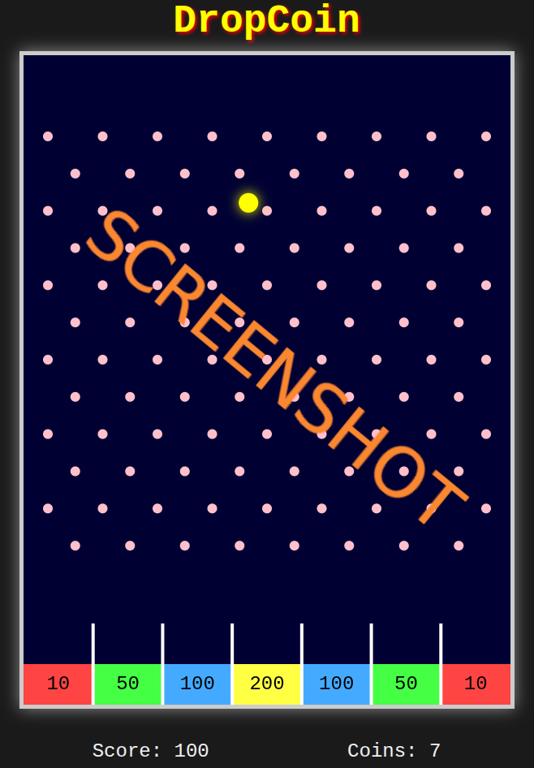

# js_dropcoin

## Play it now: https://pemmyz.github.io/js_dropcoin/

# 🪙 DropCoin

A fun and stylish physics-based coin drop game inspired by Payazzo/Pajatso machines! Move to aim and click or tap to drop the coin through a grid of pegs and try to land it in high-value gates.

> 🎯 Drop your way to the highest score before you run out of coins!

## 📸 Screenshots

### Game
  

## 🧩 Features

- 🎲 Physics-based coin drop with gravity and bouncing
- 🔁 Two visual styles:
  - **Modern:** Clean layout, more gates, smooth layout
  - **Classic:** Narrower retro style with added wall pegs
- 🧠 Smart gate divider rendering
- 🔄 Style toggle button for instant mode switching
- ☝️ Mouse & touch support (mobile-friendly)
- 🧮 Score & coin tracking + Game Over screen

## 🕹️ How to Play

- **Aim:** Move your mouse or finger
- **Drop:** Click or tap to release the coin
- **Score:** Try to land the coin into high-value gates at the bottom
- **Repeat:** You have 10 coins to use per game

## 🧑‍💻 Tech Stack

- HTML5 + CSS3
- JavaScript (Vanilla Canvas API)
- Responsive design for desktop & mobile

